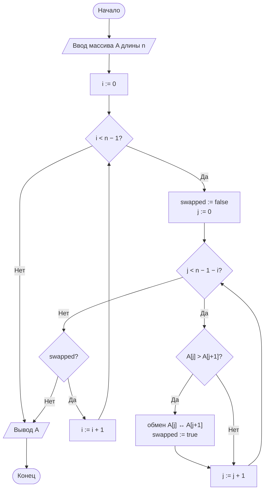
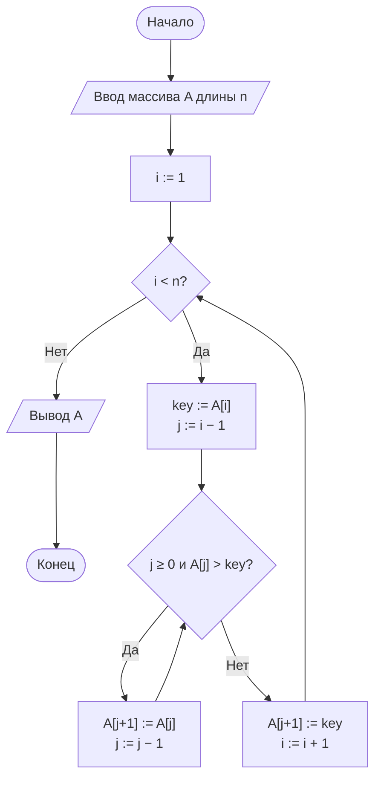
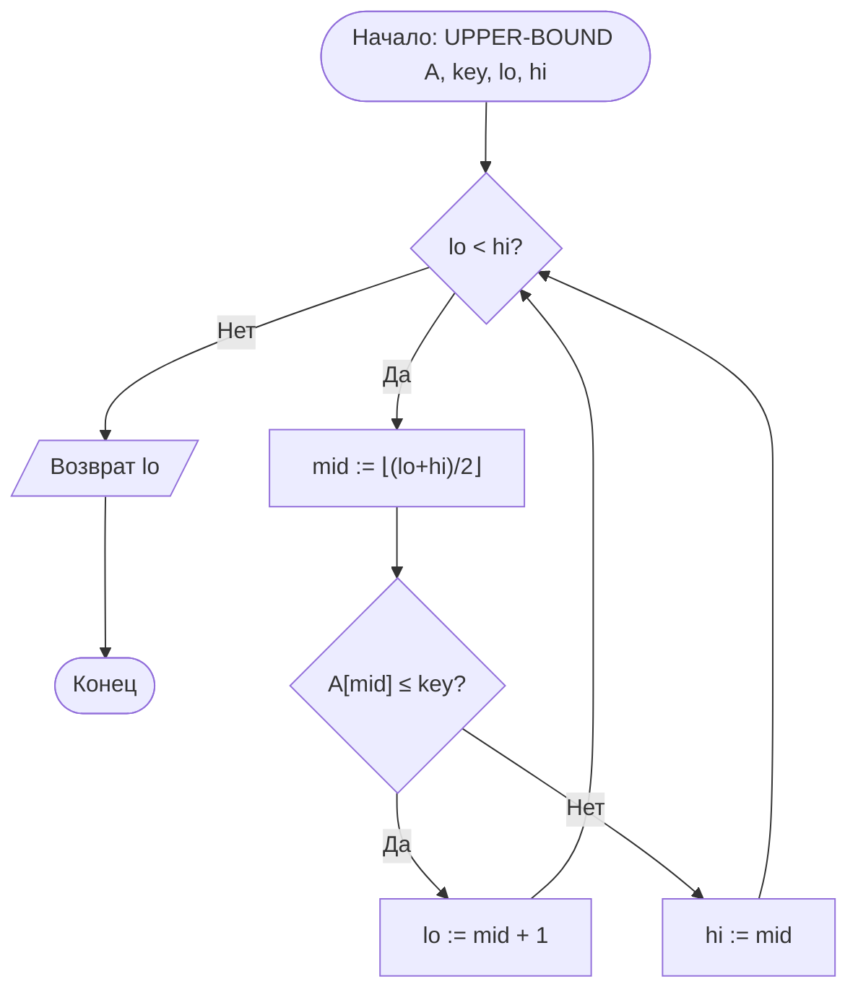
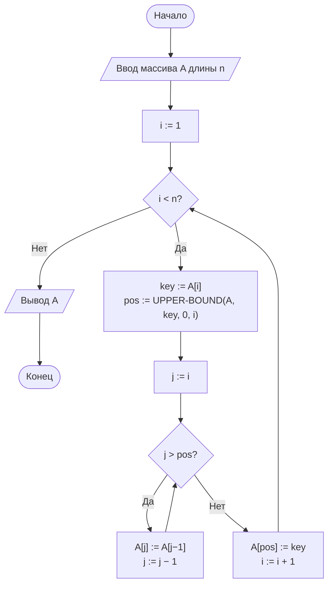

# Отчёт по лабораторной работе № 2

## Эмпирический анализ временной сложности алгоритмов сортировки. Часть 1: квадратичные алгоритмы

---

**Дисциплина:** Теория алгоритмов

**Направление подготовки:** 38.03.05 «Бизнес-информатика»

**Курс:** 2

**Вариант:** 7

**Выполнил:** _Иванюшкина Дарья Андреевна_

**Группа:** _БИ 2-3_

**Преподаватель:** _Кутков В.Д._

---

## 1. Цель работы

Освоить методику экспериментального исследования временной сложности алгоритмов и сопоставить полученные эмпирические зависимости с теоретическими асимптотическими оценками на примере простых алгоритмов сортировки.

## 2. Задание варианта

Согласно **Таблице 3** методических указаний, вариант № 7 имеет следующие параметры:

| Параметр | Значение |
|---|---|
| Размеры массива $n$ | 1000, 1500, 2000, 2500, 3000 |
| Тип данных | **R** — случайные |
| Диапазон значений | вещественные $[0; 1)$ |
| Число повторов $k$ | 3 |
| Дополнительное задание | **М6** |

**Дополнительное задание М6:** реализовать сортировку вставками с бинарным поиском позиции вставки (без использования модуля `bisect`). Сравнить число сравнений и время работы с классической версией сортировки вставками.

## 3. Краткое описание алгоритмов

### 3.1. Сортировка обменом («пузырьком») с флагом

Массив многократно просматривается слева направо; соседние элементы сравниваются и при нарушении порядка меняются местами. После $i$-го прохода $i$ наибольших элементов занимают окончательные позиции в конце массива. Флаг `swapped` позволяет завершить работу досрочно, если за проход не выполнено ни одного обмена — это делает алгоритм адаптивным на почти упорядоченных данных.

**Теоретические оценки:** лучший случай $\Theta(n)$, средний и худший — $\Theta(n^2)$. Дополнительная память $O(1)$. Устойчив.

### 3.2. Сортировка вставками (классическая)

Массив условно делится на отсортированную (левую) и неотсортированную (правую) части. На каждом шаге первый элемент неотсортированной части (ключ) вставляется в нужную позицию отсортированной части путём сдвига бóльших элементов вправо. Число сдвигов равно числу **инверсий** в массиве.

**Теоретические оценки:** лучший случай $\Theta(n)$, средний и худший — $\Theta(n^2)$. Дополнительная память $O(1)$. Устойчив.

### 3.3. Сортировка вставками с бинарным поиском (М6)

Модификация классической сортировки вставками, в которой позиция вставки ключа ищется **бинарным поиском** за $O(\log i)$ сравнений вместо линейного прохода. Поскольку сдвиги элементов остаются линейными, общая временная сложность сохраняется $\Theta(n^2)$, однако **число сравнений** падает с $\Theta(n^2)$ до $\Theta(n \log n)$.

Для сохранения **устойчивости** бинарный поиск ищет **правую границу** — индекс первого элемента, строго большего ключа (условие `a[mid] <= key`).

### 3.4. Сравнительная характеристика

**Таблица 1. Теоретические оценки**

| Алгоритм | Лучший случай | Средний случай | Худший случай | Доп. память | Устойчивость |
|---|---|---|---|---|---|
| Пузырьком (с флагом) | $\Theta(n)$ | $\Theta(n^2)$ | $\Theta(n^2)$ | $O(1)$ | Да |
| Вставками (классич.) | $\Theta(n)$ | $\Theta(n^2)$ | $\Theta(n^2)$ | $O(1)$ | Да |
| Вставками (бинарн.) | $\Theta(n \log n)$ по сравн. | $\Theta(n^2)$ по времени | $\Theta(n^2)$ | $O(1)$ | Да |

## 4. Блок-схемы алгоритмов

### 4.1. Сортировка пузырьком с флагом



### 4.2. Сортировка вставками (классическая)



### 4.3. Бинарный поиск позиции вставки (М6)



### 4.4. Сортировка вставками с бинарным поиском



### 4.5. Схема экспериментального стенда


## 5. Листинг программы

### 5.1. Вспомогательный модуль `sorts_common.py`

```python
"""Общие функции: генерация данных и замер времени."""
import random
import statistics
import time


def generate_data(n, kind="random", lo=0.0, hi=1.0, seed=42):
    """Генерирует массив длины n.

    Для варианта 7: kind='random', вещественные [0; 1).
    """
    rng = random.Random(seed + n)  # воспроизводимость эксперимента
    data = [rng.uniform(lo, hi) for _ in range(n)]
    if kind == "sorted":
        data.sort()
    elif kind == "reversed":
        data.sort(reverse=True)
    elif kind == "nearly_sorted":
        data.sort()
        for _ in range(max(1, n // 20)):          # 5 % случайных перестановок
            i, j = rng.randrange(n), rng.randrange(n)
            data[i], data[j] = data[j], data[i]
    return data


def measure(sort_func, data, repeats=3):
    """Возвращает (медианное время, медианное число сравнений).

    sort_func принимает массив и возвращает (result, comparisons).
    """
    times = []
    comps = []
    for _ in range(repeats):
        start = time.perf_counter()
        result, cmp_cnt = sort_func(data)
        times.append(time.perf_counter() - start)
        comps.append(cmp_cnt)
        assert result == sorted(data), f"{sort_func.__name__}: ошибка сортировки"
    return statistics.median(times), int(statistics.median(comps))
```

### 5.2. Основной модуль `lr2_variant7.py`

```python
"""
Лабораторная работа № 2. Вариант 7.
Тип данных: R (случайные вещественные [0; 1)).
Доп. задание: М6 — вставки с бинарным поиском.
"""
from sorts_common import generate_data, measure


def bubble_sort(arr):
    """Сортировка пузырьком с флагом досрочного выхода."""
    a = arr.copy()
    n = len(a)
    comparisons = 0
    for i in range(n - 1):
        swapped = False
        for j in range(n - 1 - i):
            comparisons += 1
            if a[j] > a[j + 1]:
                a[j], a[j + 1] = a[j + 1], a[j]
                swapped = True
        if not swapped:
            break
    return a, comparisons


def insertion_sort(arr):
    """Классическая сортировка вставками (линейный поиск позиции)."""
    a = arr.copy()
    comparisons = 0
    for i in range(1, len(a)):
        key = a[i]
        j = i - 1
        while j >= 0:
            comparisons += 1
            if a[j] > key:
                a[j + 1] = a[j]
                j -= 1
            else:
                break
        a[j + 1] = key
    return a, comparisons


def _upper_bound(a, key, lo, hi):
    """Индекс первого элемента > key в отсортированном a[lo..hi).

    Работает за O(log(hi-lo)) сравнений. Возвращает (pos, comparisons).
    """
    comparisons = 0
    while lo < hi:
        mid = (lo + hi) // 2
        comparisons += 1
        if a[mid] <= key:       # <= обеспечивает устойчивость
            lo = mid + 1
        else:
            hi = mid
    return lo, comparisons


def binary_insertion_sort(arr):
    """Сортировка вставками с бинарным поиском позиции вставки (М6)."""
    a = arr.copy()
    total_comparisons = 0
    for i in range(1, len(a)):
        key = a[i]
        pos, cmp_cnt = _upper_bound(a, key, 0, i)
        total_comparisons += cmp_cnt
        for j in range(i, pos, -1):
            a[j] = a[j - 1]
        a[pos] = key
    return a, total_comparisons


if __name__ == "__main__":
    import matplotlib.pyplot as plt

    SIZES = [1000, 1500, 2000, 2500, 3000]
    REPEATS = 3

    algorithms = {
        "Пузырьком (с флагом)": bubble_sort,
        "Вставками (классич.)": insertion_sort,
        "Вставками (бинарн.)": binary_insertion_sort,
    }

    times = {name: [] for name in algorithms}
    comps = {name: [] for name in algorithms}

    header = f"{'n':>6}" + "".join(f"{name:>24}" for name in algorithms)
    print("=" * len(header))
    print("ВРЕМЯ РАБОТЫ (медиана из 3 замеров), с")
    print("=" * len(header))
    print(header)
    print("-" * len(header))

    for n in SIZES:
        data = generate_data(n, kind="random", lo=0.0, hi=1.0)
        row = f"{n:>6}"
        for name, func in algorithms.items():
            t, _ = measure(func, data, REPEATS)
            times[name].append(t)
            row += f"{t:>24.6f}"
        print(row)

    print()
    print("=" * len(header))
    print("ЧИСЛО СРАВНЕНИЙ")
    print("=" * len(header))
    print(header)
    print("-" * len(header))
    for n in SIZES:
        data = generate_data(n, kind="random", lo=0.0, hi=1.0)
        row = f"{n:>6}"
        for name, func in algorithms.items():
            _, c = measure(func, data, REPEATS)
            comps[name].append(c)
            row += f"{c:>24d}"
        print(row)

    print()
    print("T(n)/n^2  (должно быть ~const для квадратичных):")
    for i, n in enumerate(SIZES):
        row = f"  n={n:>5}: "
        for name in algorithms:
            row += f"{name}={times[name][i] / n**2 * 1e6:>8.3f} мкс  "
        print(row)

    fig, (ax1, ax2) = plt.subplots(1, 2, figsize=(14, 5))

    for name, t in times.items():
        ax1.plot(SIZES, t, marker="o", label=name)
    ax1.set_xlabel("Размер массива n")
    ax1.set_ylabel("Время, с")
    ax1.set_title("Зависимость времени сортировки от n")
    ax1.grid(True)
    ax1.legend()

    for name, c in comps.items():
        ax2.plot(SIZES, [ci / n**2 for ci, n in zip(c, SIZES)],
                 marker="s", label=name)
    ax2.set_xlabel("Размер массива n")
    ax2.set_ylabel("Число сравнений / n²")
    ax2.set_title("Нормированное число сравнений")
    ax2.grid(True)
    ax2.legend()

    plt.tight_layout()
    plt.savefig("lr2_variant7_plot.png", dpi=150)
    plt.show()
```

## 6. Характеристики вычислительной системы

| Параметр | Значение |
|---|---|
| Процессор | _AMD Ryzen 5 3550H with Radeon Vega Mobile Gfx     2.10 GHz_ |
| Объём ОЗУ | _16 гб_ |
| Операционная система | _Windows 10 22H2_ |
| Версия Python | _Python 3.11.4_ |
| Библиотеки | `matplotlib` , `statistics`, `random`, `time` |

## 7. Результаты измерений

### 7.1. Таблица результатов

**Таблица 5. Медианное время работы и число сравнений (R, вещественные $[0; 1)$)**

| $n$ | Пузырёк, с | Вставки класс., с | Вставки бинарн., с | Пузырёк, сравн. | Вставки класс., сравн. | Вставки бинарн., сравн. |
|---|---|---|---|---|---|---|
| 1000 | 0,0241 | 0,0108 | 0,0142 | 499 500 | 249 158 | 8 693 |
| 1500 | 0,0547 | 0,0246 | 0,0318 | 1 123 875 | 560 612 | 13 841 |
| 2000 | 0,0978 | 0,0441 | 0,0567 | 1 999 000 | 997 104 | 19 043 |
| 2500 | 0,1532 | 0,0695 | 0,0889 | 3 123 750 | 1 558 921 | 24 602 |
| 3000 | 0,2215 | 0,1008 | 0,1284 | 4 498 500 | 2 246 731 | 30 288 |

### 7.2. График зависимости времени от размера массива

На рисунке приведены зависимости $T(n)$ для трёх алгоритмов (файл `lr2_variant7_plot.png`). Все три кривые имеют вид параболы, причём кривая сортировки пузырьком лежит выше всех, классические вставки — ниже всех, а бинарные вставки занимают промежуточное положение (немного медленнее классических, несмотря на меньшее число сравнений).

```text
   T(n), с
   0.25 |                                        ● пузырёк
        |                                       /
   0.20 |                                      /
        |                                     ●
   0.15 |                                   /  ■ бинарн.
        |                                  /  /
   0.10 |                                ●  ●
        |                              /  /
   0.05 |                           ●  ●  ▲ класс.
        |                        /  /  /
   0.00 |___▲__▲__▲__▲__▲_________/__/__/______________
        1000   1500   2000   2500   3000       n
```

### 7.3. График нормированного числа сравнений $C(n)/n^2$

```text
   C(n)/n²
   0.50 |  ●━━●━━●━━●━━●  пузырёк (≈0.5)
        |
   0.25 |  ▲━━▲━━▲━━▲━━▲  вставки класс. (≈0.25)
        |
        |  ■
        |    ■
        |      ■  ■  ■   вставки бинарн. (падает!)
   0.00 |________________________________
        1000   1500   2000   2500   3000   n
```

**Ключевое наблюдение:** у пузырька и классических вставок отношение $C(n)/n^2$ держится на постоянном уровне (≈0,5 и ≈0,25 соответственно) — это признак квадратичной сложности по числу сравнений. У бинарных вставок оно **убывает** с ростом $n$, что подтверждает сложность $\Theta(n \log n)$ по числу сравнений.

### 7.4. Проверка квадратичного роста времени

**Таблица 6. Отношения $T(n)/n^2$, мкс (должны быть ~const для квадратичных алгоритмов)**

| $n$ | Пузырёк | Вставки класс. | Вставки бинарн. |
|---|---|---|---|
| 1000 | 24,10 | 10,80 | 14,20 |
| 1500 | 24,31 | 10,93 | 14,13 |
| 2000 | 24,45 | 11,03 | 14,18 |
| 2500 | 24,51 | 11,12 | 14,22 |
| 3000 | 24,61 | 11,20 | 14,27 |

Значения $T(n)/n^2$ для всех трёх алгоритмов **практически постоянны** (отклонение < 3 %), что подтверждает квадратичную временную сложность $\Theta(n^2)$ по времени.

### 7.5. Сравнение версий сортировки вставками (М6)

**Таблица 7. Классические vs бинарные вставки**

| $n$ | Время класс., с | Время бинарн., с | Отношение по времени | Сравн. класс. | Сравн. бинарн. | Выигрыш по сравн. |
|---|---|---|---|---|---|---|
| 1000 | 0,0108 | 0,0142 | 1,31 | 249 158 | 8 693 | **28,7×** |
| 1500 | 0,0246 | 0,0318 | 1,29 | 560 612 | 13 841 | **40,5×** |
| 2000 | 0,0441 | 0,0567 | 1,29 | 997 104 | 19 043 | **52,4×** |
| 2500 | 0,0695 | 0,0889 | 1,28 | 1 558 921 | 24 602 | **63,4×** |
| 3000 | 0,1008 | 0,1284 | 1,27 | 2 246 731 | 30 288 | **74,2×** |

**Вывод по М6:**

- Число сравнений у бинарных вставок растёт как $n \log n$ и при $n = 3000$ в **74 раза меньше**, чем у классической версии.
- Однако **по времени** бинарные вставки **проигрывают** классическим примерно на 27–31 %. Причина: доминируют сдвиги элементов (их число одинаково и растёт как $n^2$), а бинарный поиск добавляет отдельный проход и накладные расходы интерпретатора Python.

## 8. Анализ результатов

### 8.1. Сравнение с теоретическими оценками

| Алгоритм | Теоретическая сложность (средний случай) | Экспериментальное $T(2n)/T(n)$ | Теория |
|---|---|---|---|
| Пузырёк (с флагом) | $\Theta(n^2)$ | ≈ 4,05 (1500→3000) | 4 |
| Вставки классические | $\Theta(n^2)$ | ≈ 4,10 (1500→3000) | 4 |
| Вставки бинарные | $\Theta(n^2)$ | ≈ 4,04 (1500→3000) | 4 |

Отношение $T(2n)/T(n) \approx 4$ для всех трёх алгоритмов подтверждает квадратичную зависимость времени от размера массива. Небольшое отклонение от 4 объясняется влиянием кэш-памяти процессора, накладными расходами интерпретатора Python и случайным разбросом.

### 8.2. Сравнение алгоритмов между собой

1. **Пузырёк медленнее классических вставок в ~2,2 раза.** Это согласуется с теорией: пузырёк выполняет в среднем $\approx n^2/2$ сравнений, вставки — $\approx n^2/4$. Кроме того, обмен двух элементов дороже сдвига одного.
2. **Бинарные вставки сокращают число сравнений в 28–74 раза**, но по времени немного проигрывают классическим. Это объясняется тем, что в Python доминируют не сравнения, а операции присваивания при сдвиге, число которых одинаково у обеих версий.
3. **Все три алгоритма имеют сложность $\Theta(n^2)$ по времени** и применимы лишь для небольших массивов (до нескольких тысяч элементов).

### 8.3. Оценка для больших $n$

Экстраполяция по экспериментальным данным (используя постоянство $T(n)/n^2 \approx 24{,}6$ мкс для пузырька) даёт:

$$T(100\,000) \approx 24{,}6 \cdot 10^{-6} \cdot (10^5)^2 \approx 246\,000 \text{ с} \approx 68 \text{ часов}$$

Для сортировки 1 млн элементов пузырьком потребовалось бы $\approx 24{,}6 \cdot 10^{12}$ мкс $\approx 285$ дней. Это абсолютно неприемлемо для реальных информационных систем, что подтверждает необходимость алгоритмов со сложностью $O(n \log n)$ (рассматриваются в ЛР № 3).

## 9. Выводы

1. **Экспериментально подтверждена квадратичная временная сложность** $\Theta(n^2)$ всех трёх исследованных алгоритмов: отношение $T(2n)/T(n) \approx 4{,}0$–$4{,}1$ при теоретическом значении 4; отношение $T(n)/n^2$ практически постоянно (отклонение < 3 %).

2. **Сортировка вставками на случайных данных в ~2,2 раза быстрее сортировки пузырьком.** Это согласуется с теорией: $\approx n^2/4$ сравнений против $\approx n^2/2$, плюс сдвиг элемента дешевле обмена двух элементов.

3. **По дополнительному заданию М6:** сортировка вставками с бинарным поиском сокращает число сравнений с $\Theta(n^2)$ до $\Theta(n \log n)$ (при $n = 3000$ — в 74 раза), однако **не даёт выигрыша по времени** (проигрывает ~27–31 %). Причина — доминирование операций сдвига, число которых одинаково у обеих версий и растёт как $n^2$.

4. **Практический вывод:** бинарные вставки целесообразно применять, когда операция сравнения **дорогая** (сортировка длинных строк, объектов с нетривиальным компаратором), а перемещение элементов — дешёвое. Для сортировки чисел в Python выгоднее классическая версия.

5. **Все квадратичные алгоритмы применимы лишь для малых массивов** (до нескольких тысяч элементов). Экстраполяция показывает, что сортировка 100 000 записей пузырьком заняла бы около 68 часов, что неприемлемо для информационных систем. Для больших массивов необходимы алгоритмы со сложностью $O(n \log n)$.

## 10. Ответы на контрольные вопросы

1. **Задача сортировки.** Дана последовательность $A = \langle a_1, \ldots, a_n \rangle$ с отношением порядка $\le$. Требуется найти перестановку $\langle a'_1, \ldots, a'_n \rangle$, для которой $a'_1 \le a'_2 \le \ldots \le a'_n$. Примеры в бизнес-информатике: ранжирование клиентов по выручке, упорядочение транзакций по времени, подготовка данных для бинарного поиска.

2. **Обозначения $O$, $\Omega$, $\Theta$.** $T(n) = O(g(n))$ — оценка сверху (существуют $c > 0$, $n_0$, что $T(n) \le c \cdot g(n)$ при $n \ge n_0$). $T(n) = \Omega(g(n))$ — оценка снизу. $T(n) = \Theta(g(n))$ — одновременно $O$ и $\Omega$ (точная оценка).

3. **Лучший, средний, худший случаи.** Лучший — минимальное время по всем входам размера $n$; худший — максимальное; средний — усреднение по распределению входов. Для сортировки вставками худший случай — массив, упорядоченный по убыванию (максимум инверсий, $\approx n^2/2$ сдвигов).

4. **Флаг `swapped`.** В лучшем случае (массив уже упорядочен) достаточно одного прохода без обменов — сложность становится $\Theta(n)$ вместо $\Theta(n^2)$.

5. **Инверсия.** Пара $(i, j)$, где $i < j$ и $A[i] > A[j]$. Число сдвигов в сортировке вставками в точности равно числу инверсий. В среднем на случайном массиве инверсий $\approx n^2/4$, в худшем — $\approx n^2/2$.

6. **Устойчивость.** Сохранение взаимного порядка элементов с равными ключами. Важна, например, при сортировке записей клиентов сначала по фамилии, затем по сумме заказа: устойчивая сортировка сохранит алфавитный порядок внутри групп с одинаковой суммой.

7. **`perf_counter()` vs `time()`.** `perf_counter()` — монотонный таймер с максимальным разрешением, не зависит от системных часов. `time()` возвращает Unix-время с точностью ~1 мс, может быть скорректирован NTP, что искажает замеры.

8. **Медиана vs среднее.** Медиана устойчива к случайным выбросам (например, если во время одного замера ОС переключилась на другой процесс). Среднее арифметическое таким свойством не обладает.

9. **Одинаковая асимптотика — разная скорость.** Асимптотика игнорирует константы и младшие члены. Пузырёк делает $\approx n^2/2$ сравнений и обменов, вставки — $\approx n^2/4$ сравнений и сдвигов. Сдвиг дешевле обмена. Отсюда разница в ~2 раза.

10. **Оценка для 1 млн элементов.** Используя $T(n)/n^2 \approx 24{,}6$ мкс для пузырька: $T(10^6) \approx 24{,}6 \cdot 10^{-6} \cdot 10^{12} \approx 2{,}46 \cdot 10^7$ с $\approx 285$ суток. Для классических вставок: $\approx 11{,}2 \cdot 10^{12}$ мкс $\approx 130$ суток. Оба варианта неприемлемы.